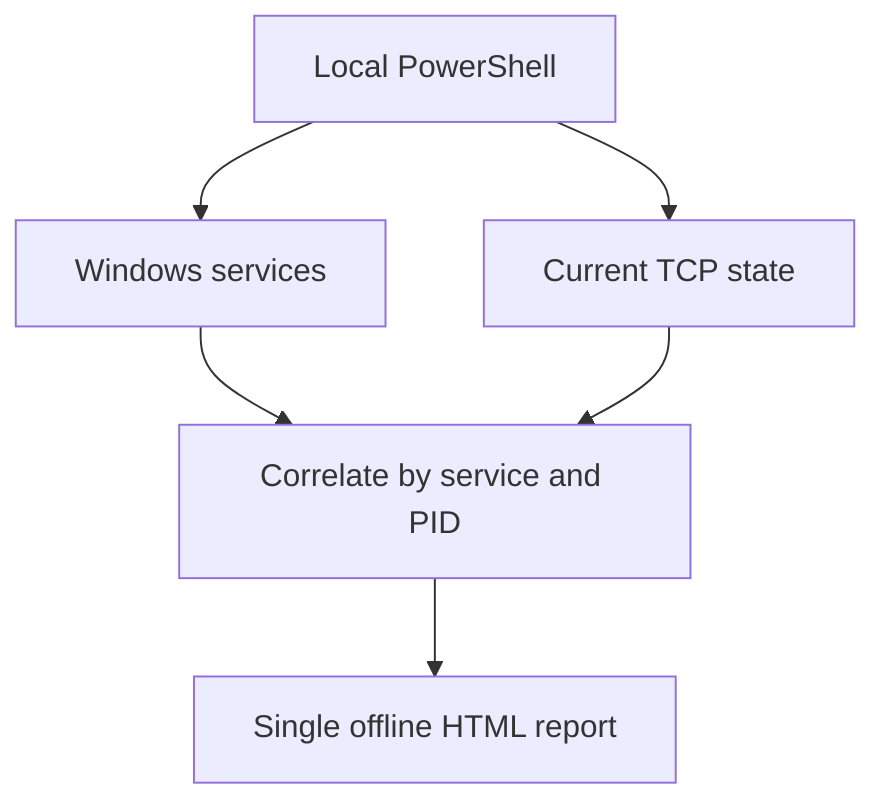

# Service Dependency Mapper v2

Service Dependency Mapper v2 is a lightweight, local-only PowerShell tool for understanding Windows service relationships on one computer. It creates one self-contained interactive HTML report containing:

- installed Windows services and their current state;
- service-control dependencies and dependent services;
- service-owned TCP listening ports;
- current outbound TCP endpoints owned by service processes;
- observed local service-to-service TCP connections where they can be correlated;
- an interactive dependency map and searchable evidence tables.

There is no agent, installer, module, Python runtime, WinRM requirement, web server, JSON snapshot, configuration parser, database, internet connection, or paid component.

## Quick start

1. Extract the ZIP to a local folder, for example:

   ```text
   C:\Tools\Service-Dependency-Mapper
   ```

2. For the most complete result, right-click `Start-ServiceDependencyMapper.cmd` and choose **Run as administrator**.
3. Confirm the report folder, leave **Include stopped services** selected, and click **Scan this computer**.
4. The report opens in your default browser when the scan completes.

If you encounter issues with the .cmd launching, try running from powershell with an execution policy bypass.

The launcher uses `-ExecutionPolicy Bypass` for that PowerShell process only. It does not permanently alter the computer's execution policy. An execution policy enforced through Group Policy still takes precedence.

## What the scan does



The script uses read-only Windows commands:

- `Get-CimInstance Win32_Service`;
- `Get-Service`;
- `Get-NetTCPConnection`;
- `Get-NetIPAddress` when available.

It does not start, stop, restart, install, remove, or reconfigure a service. It does not change the firewall, registry, scheduled tasks, WinRM, networking, or execution policy.

## Running from PowerShell

Open the WinForms menu:

```powershell
powershell.exe -NoLogo -NoProfile -ExecutionPolicy Bypass -STA `
    -File .\ServiceDependencyMapper.ps1
```

Run without the menu and open the completed report:

```powershell
powershell.exe -NoLogo -NoProfile -ExecutionPolicy Bypass `
    -File .\ServiceDependencyMapper.ps1 `
    -NoGui `
    -OpenReport
```

Scan only running services and choose another report folder:

```powershell
powershell.exe -NoLogo -NoProfile -ExecutionPolicy Bypass `
    -File .\ServiceDependencyMapper.ps1 `
    -NoGui `
    -RunningServicesOnly `
    -OutputFolder C:\Temp\ServiceReports `
    -OpenReport
```

## Report contents

The report is written to `Reports` beside the script unless another folder is selected:

```text
Service-Dependency-Report-SERVER01-YYYYMMDD-HHMMSS.html
```

The report contains an interactive focus map. Choose a service from the list to display up to 22 nearby relationships. The evidence table beneath the graph always contains the complete captured set and can be searched.

Relationship types:

| Relationship | Meaning |
| --- | --- |
| Declared dependency | Windows Service Control Manager says the selected service depends on another service |
| Dependent service | Another service declares the selected service as a dependency |
| Listening port | The service process owned a TCP listener during collection |
| Outbound TCP | The service process had a current TCP connection to an endpoint |
| Observed local TCP | The source service connected to a local port owned by another service process |

## Important interpretation limits

- TCP information is a point-in-time view, not historical packet capture. Short-lived or idle dependencies may be absent.
- Windows can host several services in one process, especially `svchost.exe`. Network evidence for a shared PID is labelled and may apply to any service in that process.
- A visible connection is not automatically a required or approved dependency.
- An absent connection is not proof that the dependency is unused.
- Run as Administrator for the best chance of obtaining complete binary paths and TCP ownership details.
- The HTML contains sensitive infrastructure metadata. Store and retain it using your organisation's normal security policy.

## Server Core and GUI fallback

If WinForms is unavailable, the script automatically falls back to console mode, performs the local scan, and prints the report path. You can also use `-NoGui` explicitly.

## Maintenance

All application logic, report styling, and report JavaScript are contained in `ServiceDependencyMapper.ps1`.

For a maintenance release:

1. update `$script:SdmVersion` near the top of the script;
2. keep every collector read-only;
3. do not add external JavaScript, fonts, CDNs, or internet requests;
4. test both the WinForms and `-NoGui` paths on a non-production Windows endpoint;
5. test once as Administrator and once as a standard user;
6. verify a report with no active service connections still opens correctly;
7. inspect a server with shared-process services and confirm the report labels shared-PID evidence;
8. update this README and `QUICKSTART.txt` when public behaviour changes.

## Files

| File | Purpose |
| --- | --- |
| `ServiceDependencyMapper.ps1` | Complete collector, WinForms menu, correlation and HTML report |
| `Start-ServiceDependencyMapper.cmd` | Double-click launcher using process-scoped execution policy bypass |
| `QUICKSTART.txt` | Short operating instructions for first-line engineers |
| `README.md` | Build, operation, security and maintenance reference |
| `LICENSE` | MIT licence |

## Version

Current release: **2.0.1**

Version 2.0.1 fixes a Windows PowerShell automatic-variable collision encountered during service-to-process correlation.
